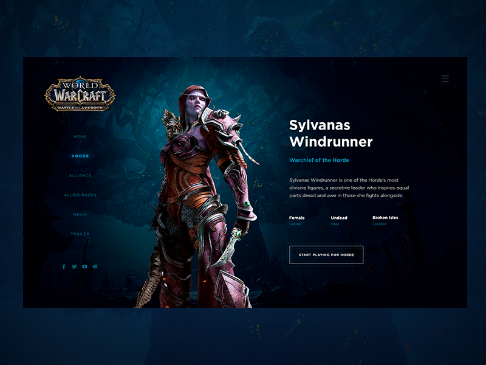

# World of Warcraft Sylvanas Layout

My first markdown readme.

## Technologies used for this small project:

* HTML.
* CSS.
* Font Awesome 5
* Bootstrap 5

#

## Original Design:

All credits to owner in Dribbble: [Kris Anfalova](https://dribbble.com/shots/4950413-World-of-Warcraft-Daily-UI-Horde)

## My project on bootstrap:

**I need clarify, this design don't have mobile version and tablet version, so i try make ''Responsive Design'' on my mind with bootstrap helpers, let me a feedback if i can do some thing best!**

## Desktop Version:

## Tablet (992px breakpoint on Bootstrap):

## Mobile:

